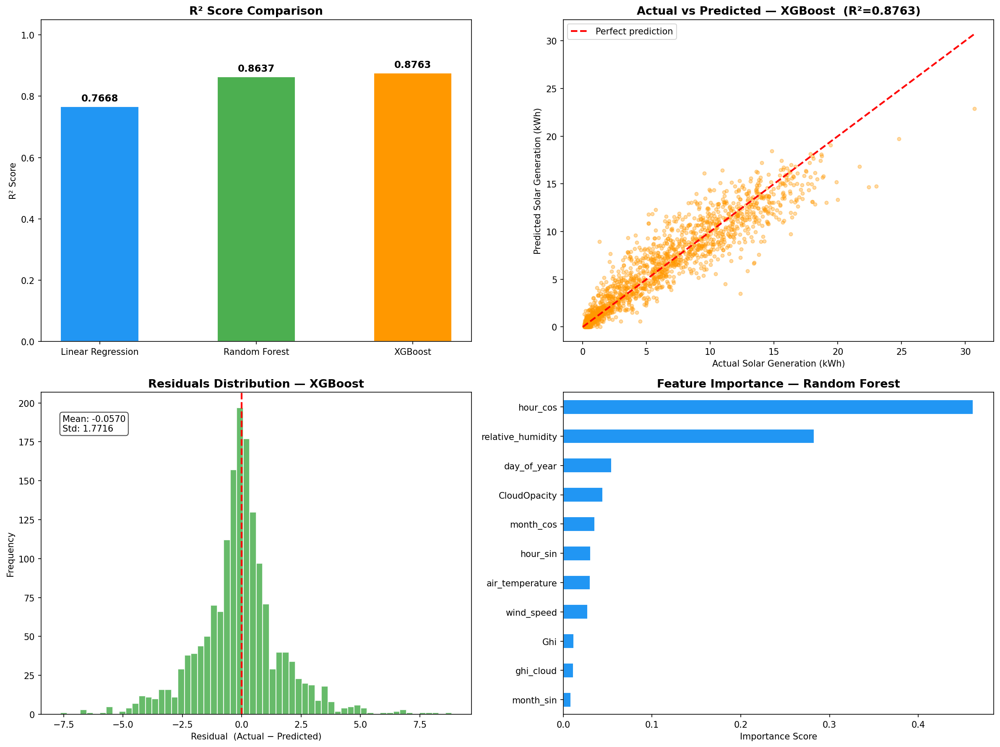

# ☀️ Solar Power Forecast

> ML-powered web app that predicts 7-day hourly solar energy generation for any city worldwide using live weather data.


---

## 📌 Overview

Solar Power Forecast is a full-stack machine learning project that predicts how much energy (in kWh) a solar panel installation will generate — hour by hour, for the next 7 days — for **any city in the world**.

The user simply types a city name. The app fetches live weather data, runs it through a trained XGBoost model, and displays interactive forecasts through a clean Streamlit dashboard.

---

## 🖥️ Demo

| 7-Day Generation Forecast | Hourly Breakdown |
|---|---|
| Bar chart with daily kWh totals | Interactive hourly solar + GHI overlay |

> **Metrics shown:** Today's output · 7-day total · Daily average · Best day · Weather snapshot

---

## ✨ Features

- 🔍 **City search** — works for any city globally via Open-Meteo geocoding
- 📅 **7-day forecast** — hourly predictions aggregated into daily summaries
- 📊 **Interactive charts** — Plotly bar + line charts with hover tooltips
- 🌤️ **Weather snapshot** — temperature, humidity, wind speed, cloud cover per day
- ⬇️ **CSV export** — download the full forecast as a spreadsheet
- ⚡ **Fast** — full forecast loads in under 3 seconds

---

## 🧠 Machine Learning

### Dataset
Trained on **8,252 hours** of real historical data (January 2020 – October 2021), merged from three sources:

| Dataset | Rows |
|---|---|
| Solar Energy Generation | 2,731,946 |
| Solar Irradiance | 102,360 |
| Weather Data | 7,396,520 |

### Features (11 total)

| Feature | Description |
|---|---|
| `Ghi` | Global Horizontal Irradiance (W/m²) |
| `CloudOpacity` | Cloud cover percentage (0–100%) |
| `ghi_cloud` | GHI × (1 − cloud/100) — effective irradiance |
| `air_temperature` | Temperature in °C |
| `relative_humidity` | Humidity percentage |
| `wind_speed` | Wind speed in m/s |
| `hour_sin` / `hour_cos` | Cyclical encoding of hour of day |
| `month_sin` / `month_cos` | Cyclical encoding of month |
| `day_of_year` | Day number (1–365) |

### Model Comparison

| Model | MAE | RMSE | R² |
|---|---|---|---|
| Linear Regression | 1.63 | 2.17 | 0.77 |
| Random Forest | 1.05 | 1.62 | 0.86 |
| **XGBoost ✅** | **1.03** | **1.57** | **0.88** |

**XGBoost** was selected as the final model and saved as `solar_model.pkl`.

### Key Engineering Decisions
- **Timezone correction** — Irradiance data was in UTC while other datasets used local time. Fixing this improved GHI correlation from **−0.15 → +0.85**
- **Cyclical encoding** — `hour` and `month` encoded as sin/cos pairs to prevent discontinuity at boundaries (e.g. hour 23 → hour 0)
- **Interaction term** — `ghi_cloud` explicitly captures cloud attenuation of sunlight

---

## 🏗️ Project Structure

```
solar-power-forecast/
│
├── Solar_Power_Model.ipynb   # Model training, EDA, and evaluation
├── solar_model.pkl           # Saved XGBoost model
├── main.py                   # Core pipeline (geocoding, weather fetch, prediction)
├── app.py                    # Streamlit web application
├── requirements.txt          # Python dependencies
├── model_results.png         # Training evaluation charts
└── README.md
```

---

## ⚙️ How It Works

```
User enters city name
        │
        ▼
Open-Meteo Geocoding API  →  lat, lon, timezone
        │
        ▼
Open-Meteo Forecast API   →  7-day hourly weather (168 rows)
        │
        ▼
Feature Engineering       →  11 model features constructed
        │
        ▼
XGBoost Model (pkl)       →  predicted_kwh per hour (clipped ≥ 0)
        │
        ▼
Streamlit Dashboard       →  charts, metrics, CSV download
```

---

## 🚀 Getting Started

### 1. Clone the repository
```bash
git clone https://github.com/your-username/solar-power-forecast.git
cd solar-power-forecast
```

### 2. Install dependencies
```bash
pip install -r requirements.txt
```

### 3. Run the app
```bash
streamlit run app.py
```

Then open `http://localhost:8501` in your browser, type any city, and click **Get Forecast**.

> **Note:** `solar_model.pkl` must be in the same directory as `app.py`. If it's missing, run `Solar_Power_Model.ipynb` end-to-end to regenerate it (requires the original CSV datasets).

---

## 📦 Dependencies

Key libraries used:

| Library | Purpose |
|---|---|
| `xgboost` | Gradient boosting model |
| `scikit-learn` | Model training & evaluation |
| `streamlit` | Web application UI |
| `plotly` | Interactive charts |
| `pandas` / `numpy` | Data processing |
| `requests` | API calls to Open-Meteo |

Full list in `requirements.txt`.

---

## 📡 APIs Used

- **[Open-Meteo Geocoding API](https://geocoding-api.open-meteo.com)** — converts city name to coordinates (free, no key required)
- **[Open-Meteo Forecast API](https://api.open-meteo.com)** — provides 7-day hourly weather forecasts (free, no key required)

---

## 📈 Results



The chart above shows:
- **R² comparison** across all three models
- **Actual vs Predicted** scatter plot (XGBoost)
- **Residuals distribution** — mean error of only −0.057 kWh
- **Feature importance** — `hour_cos` and `relative_humidity` are the dominant predictors

---

## 🔮 Future Improvements

- [ ] Support for multiple panel sizes / system capacity input
- [ ] Add tilt angle and panel orientation as features
- [ ] Historical comparison (forecast vs actual past generation)
- [ ] Email/push alerts for low-generation days
- [ ] Deploy to Streamlit Cloud / Hugging Face Spaces

---


## 📄 License

This project is licensed under the MIT License — see the [LICENSE](LICENSE) file for details.

---

*Built with ☀️ and Python*
